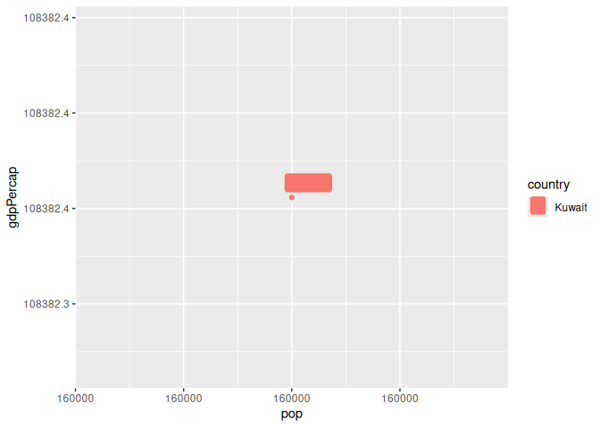
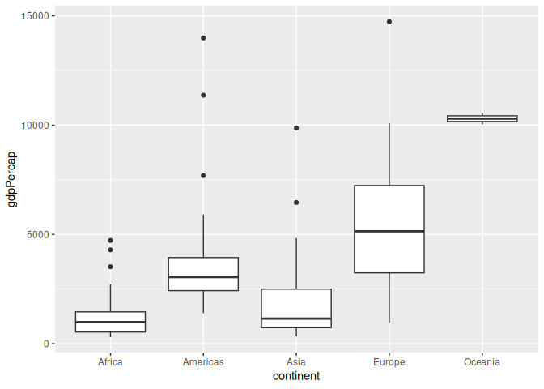
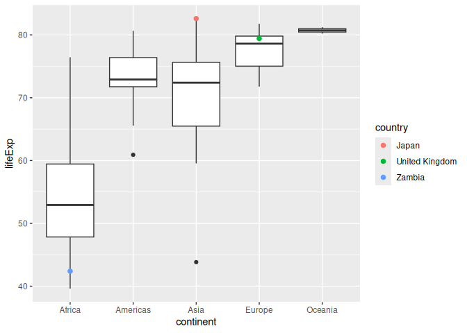
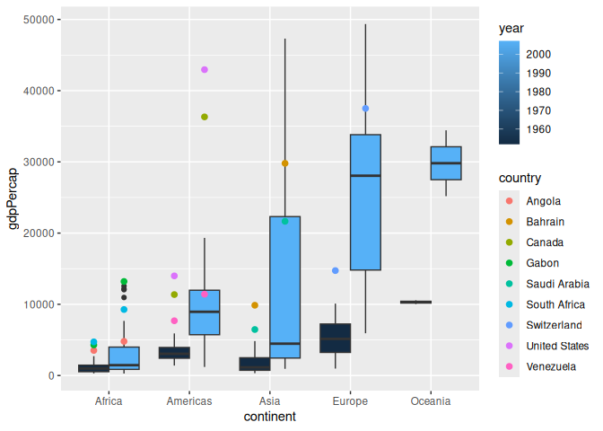
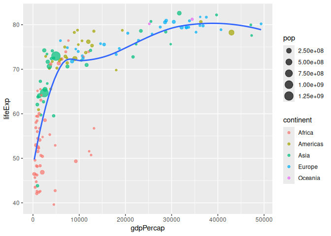
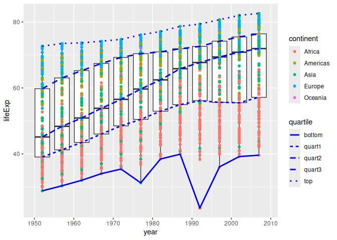
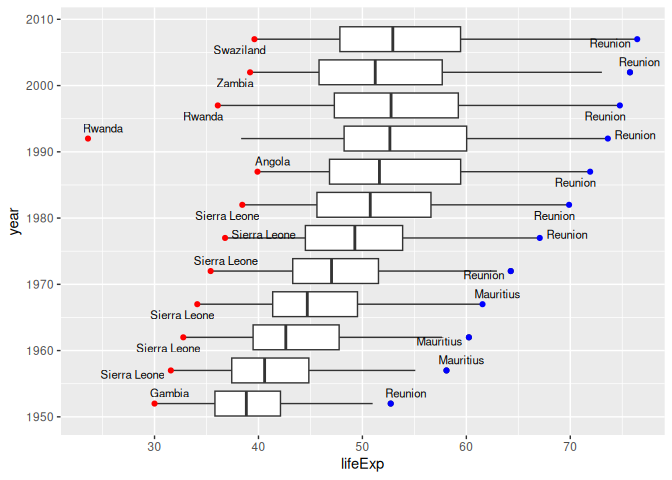

Gapminder
================
Trevor McDonald
2026-09-28

- [Grading Rubric](#grading-rubric)
  - [Individual](#individual)
  - [Submission](#submission)
- [Guided EDA](#guided-eda)
  - [**q0** Perform your “first checks” on the dataset. What variables
    are in
    this](#q0-perform-your-first-checks-on-the-dataset-what-variables-are-in-this)
  - [**q1** Determine the most and least recent years in the `gapminder`
    dataset.](#q1-determine-the-most-and-least-recent-years-in-the-gapminder-dataset)
  - [**q2** Filter on years matching `year_min`, and make a plot of the
    GDP per capita against continent. Choose an appropriate `geom_` to
    visualize the data. What observations can you
    make?](#q2-filter-on-years-matching-year_min-and-make-a-plot-of-the-gdp-per-capita-against-continent-choose-an-appropriate-geom_-to-visualize-the-data-what-observations-can-you-make)
  - [**q3** You should have found *at least* three outliers in q2 (but
    possibly many more!). Identify those outliers (figure out which
    countries they
    are).](#q3-you-should-have-found-at-least-three-outliers-in-q2-but-possibly-many-more-identify-those-outliers-figure-out-which-countries-they-are)
  - [**q4** Create a plot similar to yours from q2 studying both
    `year_min` and `year_max`. Find a way to highlight the outliers from
    q3 on your plot *in a way that lets you identify which country is
    which*. Compare the patterns between `year_min` and
    `year_max`.](#q4-create-a-plot-similar-to-yours-from-q2-studying-both-year_min-and-year_max-find-a-way-to-highlight-the-outliers-from-q3-on-your-plot-in-a-way-that-lets-you-identify-which-country-is-which-compare-the-patterns-between-year_min-and-year_max)
- [Your Own EDA](#your-own-eda)
  - [**q5** Create *at least* three new figures below. With each figure,
    try to pose new questions about the
    data.](#q5-create-at-least-three-new-figures-below-with-each-figure-try-to-pose-new-questions-about-the-data)

*Purpose*: Learning to do EDA well takes practice! In this challenge
you’ll further practice EDA by first completing a guided exploration,
then by conducting your own investigation. This challenge will also give
you a chance to use the wide variety of visual tools we’ve been
learning.

<!-- include-rubric -->

# Grading Rubric

<!-- -------------------------------------------------- -->

Unlike exercises, **challenges will be graded**. The following rubrics
define how you will be graded, both on an individual and team basis.

## Individual

<!-- ------------------------- -->

| Category | Needs Improvement | Satisfactory |
|----|----|----|
| Effort | Some task **q**’s left unattempted | All task **q**’s attempted |
| Observed | Did not document observations, or observations incorrect | Documented correct observations based on analysis |
| Supported | Some observations not clearly supported by analysis | All observations clearly supported by analysis (table, graph, etc.) |
| Assessed | Observations include claims not supported by the data, or reflect a level of certainty not warranted by the data | Observations are appropriately qualified by the quality & relevance of the data and (in)conclusiveness of the support |
| Specified | Uses the phrase “more data are necessary” without clarification | Any statement that “more data are necessary” specifies which *specific* data are needed to answer what *specific* question |
| Code Styled | Violations of the [style guide](https://style.tidyverse.org/) hinder readability | Code sufficiently close to the [style guide](https://style.tidyverse.org/) |

## Submission

<!-- ------------------------- -->

Make sure to commit both the challenge report (`report.md` file) and
supporting files (`report_files/` folder) when you are done! Then submit
a link to Canvas. **Your Challenge submission is not complete without
all files uploaded to GitHub.**

``` r
library(tidyverse)
```

    ## ── Attaching core tidyverse packages ──────────────────────── tidyverse 2.0.0 ──
    ## ✔ dplyr     1.2.1     ✔ readr     2.2.0
    ## ✔ forcats   1.0.1     ✔ stringr   1.6.0
    ## ✔ ggplot2   4.0.3     ✔ tibble    3.3.1
    ## ✔ lubridate 1.9.5     ✔ tidyr     1.3.2
    ## ✔ purrr     1.2.2     
    ## ── Conflicts ────────────────────────────────────────── tidyverse_conflicts() ──
    ## ✖ dplyr::filter() masks stats::filter()
    ## ✖ dplyr::lag()    masks stats::lag()
    ## ℹ Use the conflicted package (<http://conflicted.r-lib.org/>) to force all conflicts to become errors

``` r
library(gapminder)
```

*Background*: [Gapminder](https://www.gapminder.org/about-gapminder/) is
an independent organization that seeks to educate people about the state
of the world. They seek to counteract the worldview constructed by a
hype-driven media cycle, and promote a “fact-based worldview” by
focusing on data. The dataset we’ll study in this challenge is from
Gapminder.

# Guided EDA

<!-- -------------------------------------------------- -->

First, we’ll go through a round of *guided EDA*. Try to pay attention to
the high-level process we’re going through—after this guided round
you’ll be responsible for doing another cycle of EDA on your own!

### **q0** Perform your “first checks” on the dataset. What variables are in this

dataset?

``` r
## TASK: Do your "first checks" here!
gapminder%>%glimpse()
```

    ## Rows: 1,704
    ## Columns: 6
    ## $ country   <fct> "Afghanistan", "Afghanistan", "Afghanistan", "Afghanistan", …
    ## $ continent <fct> Asia, Asia, Asia, Asia, Asia, Asia, Asia, Asia, Asia, Asia, …
    ## $ year      <int> 1952, 1957, 1962, 1967, 1972, 1977, 1982, 1987, 1992, 1997, …
    ## $ lifeExp   <dbl> 28.801, 30.332, 31.997, 34.020, 36.088, 38.438, 39.854, 40.8…
    ## $ pop       <int> 8425333, 9240934, 10267083, 11537966, 13079460, 14880372, 12…
    ## $ gdpPercap <dbl> 779.4453, 820.8530, 853.1007, 836.1971, 739.9811, 786.1134, …

**Observations**:

- We have country, continent, year, life expectancy, population, and gdp
  per captia.

### **q1** Determine the most and least recent years in the `gapminder` dataset.

*Hint*: Use the `pull()` function to get a vector out of a tibble.
(Rather than the `$` notation of base R.)

``` r
## TASK: Find the largest and smallest values of `year` in `gapminder`
year_max <- gapminder %>% pull(year) %>% max()
year_min <- gapminder %>% pull(year) %>% min()
year_max
```

    ## [1] 2007

``` r
year_min
```

    ## [1] 1952

Use the following test to check your work.

``` r
## NOTE: No need to change this
assertthat::assert_that(year_max %% 7 == 5)
```

    ## [1] TRUE

``` r
assertthat::assert_that(year_max %% 3 == 0)
```

    ## [1] TRUE

``` r
assertthat::assert_that(year_min %% 7 == 6)
```

    ## [1] TRUE

``` r
assertthat::assert_that(year_min %% 3 == 2)
```

    ## [1] TRUE

``` r
if (is_tibble(year_max)) {
  print("year_max is a tibble; try using `pull()` to get a vector")
  assertthat::assert_that(False)
}

print("Nice!")
```

    ## [1] "Nice!"

### **q2** Filter on years matching `year_min`, and make a plot of the GDP per capita against continent. Choose an appropriate `geom_` to visualize the data. What observations can you make?

You may encounter difficulties in visualizing these data; if so document
your challenges and attempt to produce the most informative visual you
can.

``` r
library(ggrepel)
## TASK: Create a visual of gdpPercap vs continent
gapminder %>%
  filter(year == year_min,
    gdpPercap > 100000) %>%
  ggplot(aes(pop, gdpPercap, color = country)) +
  geom_point() +
  geom_label_repel(
    aes(label = country, fill = country)
  )
```

<!-- -->

``` r
gapminder %>%
  filter(
    year == year_min,
    gdpPercap < 100000
    ) %>%
  ggplot(aes(continent, gdpPercap)) +
  geom_boxplot()
```

<!-- -->

**Observations**:

- Oceania displays the highest average GDP per capita, but it also has
  very few data points to draw from.
- Europe has the second highest average GDP per capita but it also has
  the most variation.
- Each continent besides oceania has a few outliers that are higher than
  the average, but none that are lower than the average.

**Difficulties & Approaches**:

- One thing I noticed was that there was a very high outlier value that
  made it very hard to find observations otherwise. To solve, this, I
  isolated that data point to see which country it was. It turned out to
  be Kuwait, and when I looked up Kuwaits gdp percapita was in 1952, I
  found that it wasn’t even tracked until 1962. This means I could
  filter it out from my graph.
- I chose a boxplot because boxplots give me a lot more information to
  look at rather than just raw points. Seeing each quartile allowed me
  to make more observations about trends and which values are truly
  outliers.

### **q3** You should have found *at least* three outliers in q2 (but possibly many more!). Identify those outliers (figure out which countries they are).

``` r
library(ggrepel)
## TASK: Identify the outliers from q2
outlier_africa <- gapminder %>% filter(continent == "Africa", gdpPercap > 3000, year == year_min)
outlier_americas <- gapminder %>% filter(continent == "Americas", gdpPercap > 7500, year == year_min)
outlier_asia <- gapminder %>% filter(continent == "Asia", gdpPercap > 5000 & gdpPercap < 100000, year == year_min)
outlier_europe <- gapminder %>% filter(continent == "Europe", gdpPercap > 12500, year == year_min)
combined <- rbind(outlier_africa, outlier_americas, outlier_asia, outlier_europe)
combined
```

    ## # A tibble: 9 × 6
    ##   country       continent  year lifeExp       pop gdpPercap
    ##   <fct>         <fct>     <int>   <dbl>     <int>     <dbl>
    ## 1 Angola        Africa     1952    30.0   4232095     3521.
    ## 2 Gabon         Africa     1952    37.0    420702     4293.
    ## 3 South Africa  Africa     1952    45.0  14264935     4725.
    ## 4 Canada        Americas   1952    68.8  14785584    11367.
    ## 5 United States Americas   1952    68.4 157553000    13990.
    ## 6 Venezuela     Americas   1952    55.1   5439568     7690.
    ## 7 Bahrain       Asia       1952    50.9    120447     9867.
    ## 8 Saudi Arabia  Asia       1952    39.9   4005677     6460.
    ## 9 Switzerland   Europe     1952    69.6   4815000    14734.

**Observations**:

- Identify the outlier countries from q2
  - I found th outliers for each continent shown in the box plots.
    Africa: Angola, Gabon, South Africa Americas: Canada, United States,
    Venezuela Asia: Bahrain, Saudi Arabia Europe: Switzerland

*Hint*: For the next task, it’s helpful to know a ggplot trick we’ll
learn in an upcoming exercise: You can use the `data` argument inside
any `geom_*` to modify the data that will be plotted *by that geom
only*. For instance, you can use this trick to filter a set of points to
label:

``` r
## NOTE: No need to edit, use ideas from this in q4 below
gapminder %>%
  filter(year == max(year)) %>%

  ggplot(aes(continent, lifeExp)) +
  geom_boxplot() +
  geom_point(
    data = . %>% filter(country %in% c("United Kingdom", "Japan", "Zambia")),
    mapping = aes(color = country),
    size = 2
  )
```

<!-- -->

### **q4** Create a plot similar to yours from q2 studying both `year_min` and `year_max`. Find a way to highlight the outliers from q3 on your plot *in a way that lets you identify which country is which*. Compare the patterns between `year_min` and `year_max`.

*Hint*: We’ve learned a lot of different ways to show multiple
variables; think about using different aesthetics or facets.

``` r
## TASK: Create a visual of gdpPercap vs continent
gapminder %>%
  filter(
    year == year_max | year == year_min,
    gdpPercap < 100000) %>%
  ggplot(aes(continent, gdpPercap, group = str_c(year, continent))) +
  geom_boxplot(
    aes(fill = year),
    position = "dodge"
  ) + 
  geom_point(
    data = . %>% filter(
      country %in% c("Angola", "Gabon", "South Africa", "Canada", "United States", "Venezuela", "Bahrain", "Saudi Arabia", "Switzerland"),
      ),
    mapping = aes(color = country),
    size = 2,
    position = position_dodge(width = 0.75)
  )
```

<!-- -->

**Observations**:

- All continents had an average increase in gdp per capita for the 25th,
  50th, and 75th quartiles
- Oceania’s box is a lot larger. I looked it up on google and this is
  because countries like New Zealand or pacific islands didn’t start
  tracking their gdp per capita until after 1952.
- In Africa there are now more outliers, but the bottom 50% today is the
  closest to the bottom 50% in 1952 for Africa than all other
  continents.
- Venezuela is no longer an outlier in the Americas. Canada and U.S. sit
  well above any other country in the Americas
- Asia has a relatively small 25 - 50 quartile compared to its 50 -75
  quartile.
- Asia seems to exhibit the largest range followed by Europe.

# Your Own EDA

<!-- -------------------------------------------------- -->

Now it’s your turn! We just went through guided EDA considering the GDP
per capita at two time points. You can continue looking at outliers,
consider different years, repeat the exercise with `lifeExp`, consider
the relationship between variables, or something else entirely.

### **q5** Create *at least* three new figures below. With each figure, try to pose new questions about the data.

``` r
## TASK: Your first graph
gapminder %>% 
  filter(
    year == year_max) %>%
  ggplot(aes(gdpPercap, lifeExp)) +
  geom_point(aes(size = pop, color = continent), alpha = 0.7) +
  geom_smooth(se = FALSE)
```

    ## `geom_smooth()` using method = 'loess' and formula = 'y ~ x'

<!-- -->

- This graph isn’t trying to answer any question in-particular, it’s to
  try and see general trends and see if any of them are interesting.
- My initial thought was to see if population had anything to do with
  the gdp per capita, but looking at this graph, there’s nothing
  particularly interesting to me about population that sticks out.
- Visually, Africa exhibits a much lower gdp per capita and life
  expectancy than other continents
- Life expectancy seems to have a logarithmic relationship to gdp per
  capita.
- There seems to be a sharp increase in life expectancy with increasing
  gdp per capita, but that seems to diminish around 10,000 gdp per
  capita.

``` r
## TASK: Your second graph
quartiles <- gapminder %>%
  group_by(year) %>%
  summarize(
    bottom = quantile(lifeExp, 0),
    quart1 = quantile(lifeExp, .25),
    quart2 = quantile(lifeExp, .5),
    quart3 = quantile(lifeExp, .75),
    top = quantile(lifeExp, 1)
  ) %>%
  pivot_longer(
    names_to = "quartile",
    values_to = "lifeExp",
    cols = -year
  )
quartiles
```

    ## # A tibble: 60 × 3
    ##     year quartile lifeExp
    ##    <int> <chr>      <dbl>
    ##  1  1952 bottom      28.8
    ##  2  1952 quart1      39.1
    ##  3  1952 quart2      45.1
    ##  4  1952 quart3      59.8
    ##  5  1952 top         72.7
    ##  6  1957 bottom      30.3
    ##  7  1957 quart1      41.2
    ##  8  1957 quart2      48.4
    ##  9  1957 quart3      63.0
    ## 10  1957 top         73.5
    ## # ℹ 50 more rows

``` r
gapminder %>% 
  ggplot(aes(year, lifeExp)) +
  geom_boxplot(aes(group = year)) +
  geom_point(aes(color = continent)) +
  geom_line(data = quartiles, aes(linetype = quartile), color = "blue", size = 1)
```

    ## Warning: Using `size` aesthetic for lines was deprecated in ggplot2 3.4.0.
    ## ℹ Please use `linewidth` instead.
    ## This warning is displayed once per session.
    ## Call `lifecycle::last_lifecycle_warnings()` to see where this warning was
    ## generated.

<!-- -->

``` r
gapminder %>%
  filter(lifeExp < 25)
```

    ## # A tibble: 1 × 6
    ##   country continent  year lifeExp     pop gdpPercap
    ##   <fct>   <fct>     <int>   <dbl>   <int>     <dbl>
    ## 1 Rwanda  Africa     1992    23.6 7290203      737.

- This graph tries to see if there is a difference in the life
  expectancy growth between different quartiles.
- The outlier in 1992 is Rwanda. At face value this can be explained by
  their civil war ranging from 1990-1993, but according to a quick
  google search the number of people it killed before 1992 was in the
  thousands, maybe tens of thousands. However, Rwanda’s population at
  that time was north of 7 million. This suggests that this could be
  inaccurate data, and a google search supports that fact.
- There doesn’t seem to be a major disparity in growth, except both the
  0% line and the 25% line plateau after the 90s. There doesn’t seem to
  be an easy answer to support why that is.
- The median has experienced the most growth out of all the quartiles.
  Life expectancy has gone up from ~45 to ~72.
- African countries are overly represented in the bottom 2 quartiles.

``` r
## TASK: Your third graph
lower <- gapminder %>%
  filter(continent == "Africa") %>%
  group_by(year) %>%
  summarize(
    country  = country[which.min(lifeExp)],
    lifeExp  = min(lifeExp),
  )
higher <- gapminder %>%
  filter(continent == "Africa") %>%
  group_by(year) %>%
  summarize(
    country = country[which.max(lifeExp)],
    lifeExp = max(lifeExp)
  )
higher
```

    ## # A tibble: 12 × 3
    ##     year country   lifeExp
    ##    <int> <fct>       <dbl>
    ##  1  1952 Reunion      52.7
    ##  2  1957 Mauritius    58.1
    ##  3  1962 Mauritius    60.2
    ##  4  1967 Mauritius    61.6
    ##  5  1972 Reunion      64.3
    ##  6  1977 Reunion      67.1
    ##  7  1982 Reunion      69.9
    ##  8  1987 Reunion      71.9
    ##  9  1992 Reunion      73.6
    ## 10  1997 Reunion      74.8
    ## 11  2002 Reunion      75.7
    ## 12  2007 Reunion      76.4

``` r
lower
```

    ## # A tibble: 12 × 3
    ##     year country      lifeExp
    ##    <int> <fct>          <dbl>
    ##  1  1952 Gambia          30  
    ##  2  1957 Sierra Leone    31.6
    ##  3  1962 Sierra Leone    32.8
    ##  4  1967 Sierra Leone    34.1
    ##  5  1972 Sierra Leone    35.4
    ##  6  1977 Sierra Leone    36.8
    ##  7  1982 Sierra Leone    38.4
    ##  8  1987 Angola          39.9
    ##  9  1992 Rwanda          23.6
    ## 10  1997 Rwanda          36.1
    ## 11  2002 Zambia          39.2
    ## 12  2007 Swaziland       39.6

``` r
library(ggrepel)
gapminder %>%
  filter(continent == "Africa",
         lifeExp > 25) %>%
  ggplot(aes(lifeExp, year)) +
  geom_boxplot(aes(group = year)) +
  geom_point(data = lower, color = "red") +
  geom_point(data = higher, color = "blue") +
  geom_text_repel(data = higher, aes(label = country), size = 3) +
  geom_text_repel(data = lower, aes(label = country), size = 3)
```

<!-- -->

- Since Africa being grouped together in the bottom 50% of our data for
  our other two graphs, I wanted to take a little bit of a closer look.
- The two countries that appear at the top of life expectancy for Africa
  are Reunion and Mauritius which are both tiny islands off the coast of
  Madagascar. Both of these populations are around 1 million, and they
  seem to be more of a vacation spot than anything else.
- The countries on the lower end are gambia, Sierra Leone, Angola,
  Rwanda, Zambia, and Swaziland (Eswatini). I wanted to see if there was
  some geographical trend between the lowest life expectancy but I
  didn’t see any.
- Another cause I hypothesized was the decolonization period that led to
  a lot of civil wars could explain the difference, but all of these
  countries had civil wars around the same time (1960s-1970s), so that
  wouldn’t explain why the plateau has continued to today.
